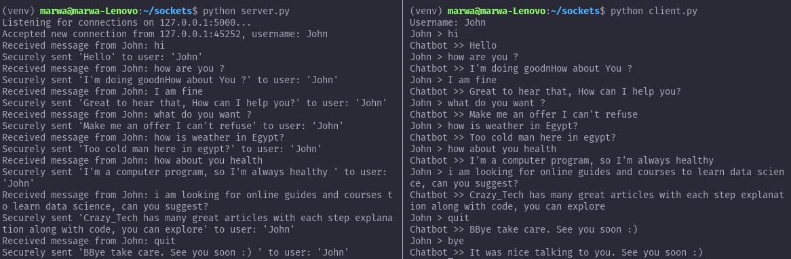

## Server-Client application using socket programming implementing TCP protocol

- The server is able to listen to multiple clients at the same time.

- Secure Socket Layer (SSL) is used for establishing an encrypted link between the server and the clients.

### requirements

```shell
pip install -r requirements.txt
```

### Run the application
#### First, run the server:
```shell
python server.py
```

#### Then, run the client in a different terminal
```shell
python client.py
```

- You can run multiple clients at the same time by opening other terminals while the server is listening. 

## Sample of the Implementaion

